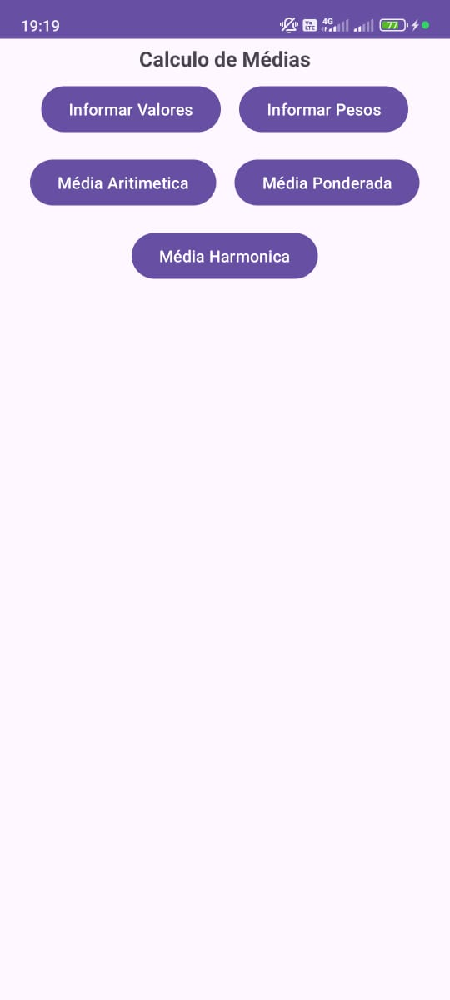
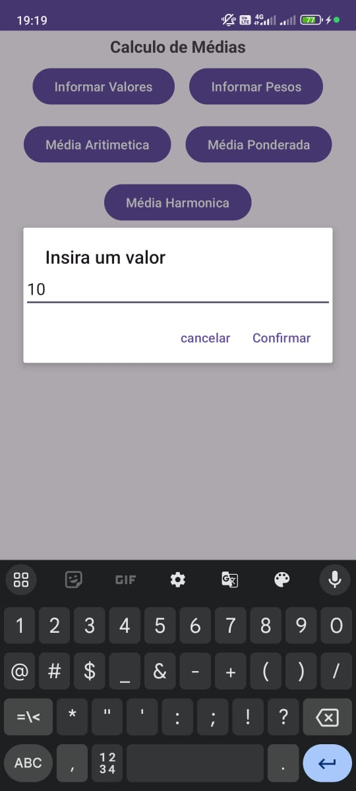
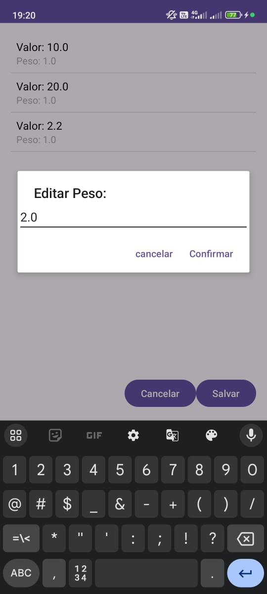
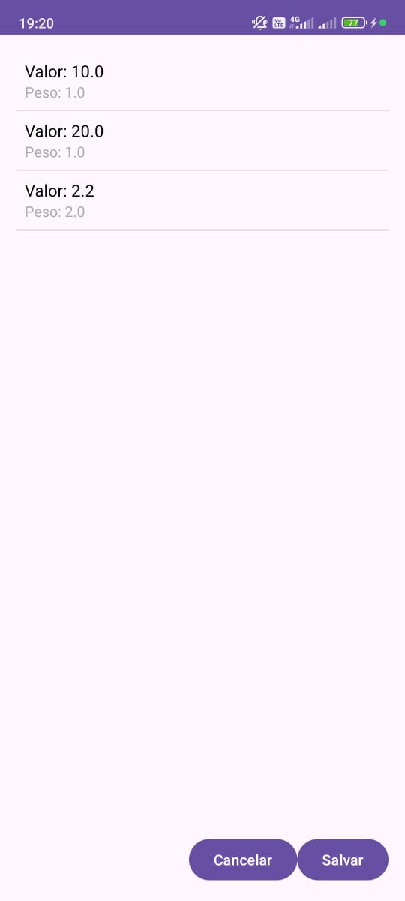
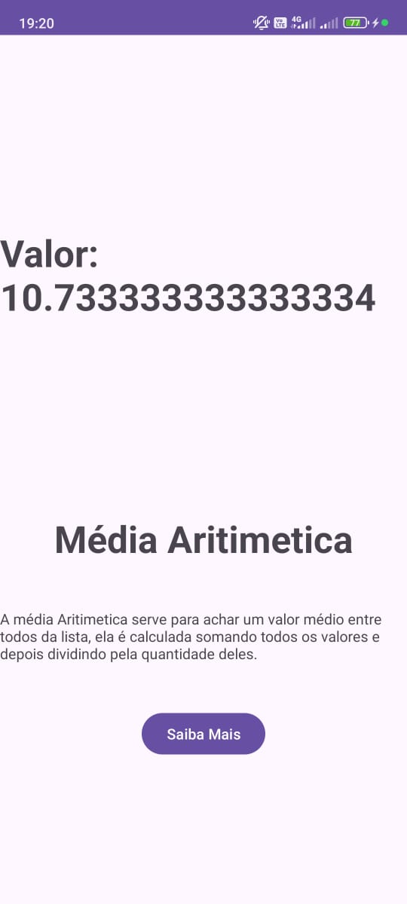
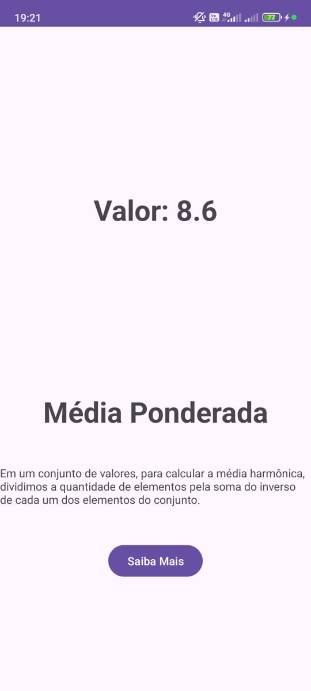
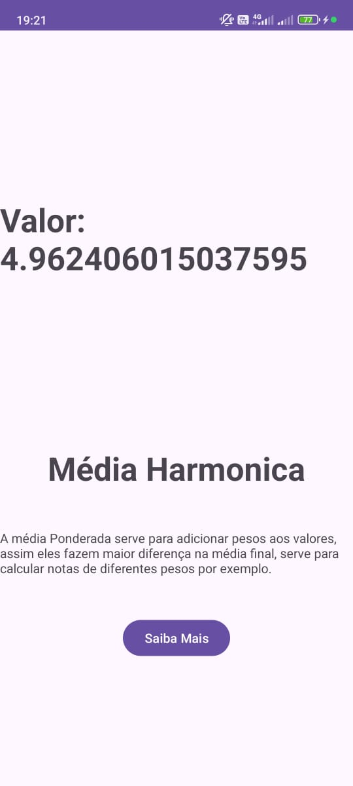

##**OBS: Use o tema claro para melhor visibilidade**

---

# **Aplicativo de Cálculo de Médias**  
### **Projeto Avaliativo - Dispositivos Móveis 1**

---

## **Descrição**  
O projeto consiste no desenvolvimento de um **aplicativo Android nativo** que permite o cálculo de **três tipos de médias**:

1. **Média aritmética**  
2. **Média ponderada**  
3. **Média harmônica**  

O aplicativo apresenta uma interface **simples e intuitiva**, seguindo as boas práticas de **UI/UX** e implementando a arquitetura **Model-View-ViewModel (MVVM)**.

---

## **Funcionalidades**  

### **Cálculo de Médias**  
- Permite ao usuário escolher entre os três tipos de média.  
- Exibe os resultados de forma clara e objetiva.  

### **Leitura de Valores e Pesos**  
- Valores e pesos são inseridos pelo usuário em **Activities** específicas.  
- Os dados são armazenados e exibidos em um **ListView** para fácil visualização.  

### **Ajuda ao Usuário**  
- Textos explicativos sobre cada tipo de média.  
- Vídeos complementares de apoio.  

---

## **Requisitos Técnicos**  

- **Plataforma:** Android (API 30+)  
- **Linguagem:** Kotlin  
- **Padrão Arquitetural:** MVVM  
- **Padrão de Projeto:** Strategy  
- **Interface:** ListView, TextView, Button  

---

## **Instalação e Execução**  

1. **Clone o repositório:**  
   ```bash
   git clone https://github.com/seu-usuario/seu-repositorio.git
   cd seu-repositorio
   ```  

2. **Abra o projeto no Android Studio.**  
3. **Compile e execute o projeto** em um emulador ou dispositivo físico.

---

## **Imagens da Aplicação**  

### **Tela Inicial**  
  

### **Inserção de Valores**  
  

### **Cálculo de Médias**  
  

---

## **Tecnologias Utilizadas**  

- **Kotlin**: Linguagem principal.  
- **Android Studio**: IDE de desenvolvimento.  
- **MVVM**: Arquitetura utilizada.  
- **Padrão Strategy**: Implementação do cálculo de diferentes médias.  

---

## **Vídeos Explicativos**  

- **Média aritmética:** [Assista aqui](https://www.youtube.com/watch?v=QS6sdNaIEo8)  
- **Média ponderada:** [Assista aqui](https://www.youtube.com/watch?v=xkHf8L0eTgU)  
- **Média harmônica:** [Assista aqui](https://www.youtube.com/watch?v=17AW2znpYmU)  

---

## **Contribuição**  
Este projeto foi desenvolvido como parte de um **exercício avaliativo** da disciplina **Dispositivos Móveis 1** sob orientação do **Prof. Ednilson Geraldo Rossi**.

---

## **Imagens do Projeto**
**Tela inicial**














  
